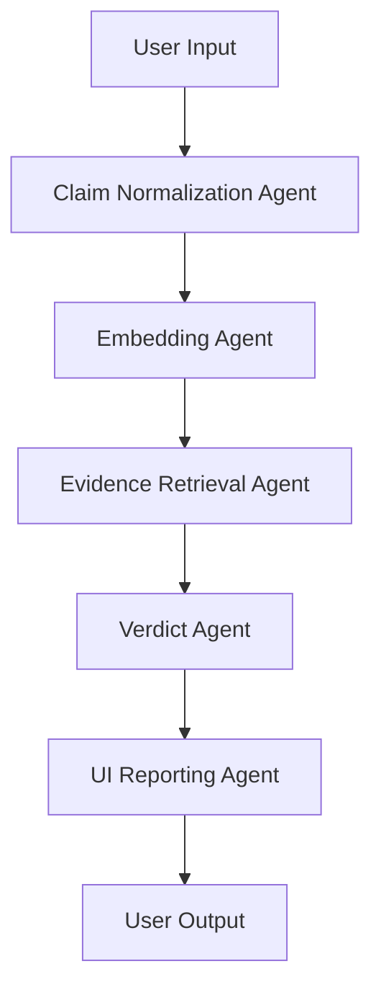

# 🛡️ Multi-Agent Fact Verification System using Qdrant (MAS Track – Convolve 4.0)

[](https://www.python.org/)
[](https://streamlit.io/)
[](https://qdrant.tech/)

This project is submitted for **Round-2 of Convolve 4.0 — Multi-Agent Intelligent Systems (MAS) Track – Qdrant**.

---

## 📋 Table of Contents

- [🧠 Problem Statement](#-problem-statement)
- [🎯 Proposed Solution](#-proposed-solution)
- [📚 Dataset Used](#-dataset-used)
- [🏗️ Architecture](#️-architecture)
- [🚀 Installation & Setup](#-installation--setup)
- [📖 Usage](#-usage)
- [📁 Project Structure](#-project-structure)
- [🔧 Configuration](#-configuration)
- [📊 Data Format](#-data-format)
- [🤖 Agent Details](#-agent-details)
- [🎨 UI Features](#-ui-features)
- [🔍 Technical Details](#-technical-details)
- [📈 Performance Considerations](#-performance-considerations)
- [🤝 Contributing](#-contributing)
- [📄 License](#-license)
- [🙏 Acknowledgments](#-acknowledgments)

---

## 🧠 Problem Statement

Misinformation spreads rapidly online without verification. The goal is to build an **intelligent system** that:

- ✅ Accepts a natural-language claim
- ✅ Searches real fact-check databases
- ✅ Retrieves relevant evidence
- ✅ Generates a verdict (+ confidence)
- ✅ Presents output in a clean UI

The system provides verdicts such as: **✔ VERIFIED** | **❌ DEBUNKED** | **❓ UNKNOWN**

---

## 🎯 Proposed Solution

I designed and implemented a **Multi-Agent Intelligent System** with the following agents:

### 1. 🧹 Claim Normalization Agent
Cleans user input for better semantic matching.

### 2. 🧠 Embedding Agent
Converts text → dense vector using `all-MiniLM-L6-v2`.

### 3. 🔍 Evidence Retrieval Agent (Qdrant)
Uses **Approximate Nearest Neighbor (ANN)** search to retrieve fact-checked evidence.

### 4. ⚖️ Verdict Agent
Calculates label ratios, applies score thresholds, and determines final verdict.

### 5. 📊 UI Reporting Agent
Displays verdict, confidence scores, evidence, and charts.

---

## 📚 Dataset Used

| Dataset | Description | Source |
|---------|-------------|--------|
| **PolitiFact Fact-Check Dataset** | Human-verified fact checks | [Kaggle Dataset](https://www.kaggle.com/datasets/liushaoping/politifact-factchecking-dataset/data) |
| **Verified Scientific Facts** | Curated verified scientific claims | `data/verified_facts.json` |

---

## 🏗️ Architecture

### System Components



### Core Components

- **🖥️ Streamlit App** (`app.py`): Web interface for user interaction
- **🤖 Agents** (`agents.py`): Multi-agent pipeline implementation
- **⚙️ Configuration** (`config.py`): Qdrant connection settings
- **📥 Data Ingestion Scripts**:
  - `create_collection.py`: Creates Qdrant collection
  - `upsert_factchecks.py`: Uploads PolitiFact data
  - `upsert_verified.py`: Uploads verified scientific facts

### Agent Workflow

1. **Input Claim** → Claim Normalization Agent
2. **Normalized Text** → Embedding Agent → Vector
3. **Vector** → Evidence Retrieval Agent → Top-K Similar Evidence
4. **Evidence** → Verdict Agent → Final Verdict + Confidence
5. **Results** → UI Reporting Agent → Display to User

---

## 🚀 Installation & Setup

### Prerequisites
- Python 3.8+
- Qdrant Cloud account (or local Qdrant instance)
- Internet connection for downloading models

### Step 1: Clone & Install Dependencies
```bash
git clone <repository-url>
cd FactCheck-MAS
pip install -r requirements.txt
```

### Step 2: Configure Qdrant
Edit `config.py` with your Qdrant credentials:
```python
QDRANT_URL = "https://19f65b30-a9ee-4dfe-a464-7ab559058c66.us-east4-0.gcp.cloud.qdrant.io"
QDRANT_API_KEY = "***"
COLLECTION_NAME = "verified_facts_text"
```

### Step 3: Download Dataset
- Download PolitiFact dataset from Kaggle
- Save as `politifact_factcheck_data.jsonl` in project root
- Create `data/verified_facts.json` with curated verified facts

### Step 4: Setup Qdrant Collection
```bash
python create_collection.py
```

### Step 5: Upload Data
```bash
python upsert_factchecks.py  # Upload PolitiFact data
python upsert_verified.py    # Upload verified facts
```

---

## 📖 Usage

### Running the Application
```bash
streamlit run app.py
```

### How to Use
1. Open the provided URL in your browser
2. Enter a claim in the text box
3. Click "Verify Claim"
4. View the verdict, confidence scores, and evidence

### Example Claims to Test
- "COVID vaccines cause infertility"
- "The Earth is flat"
- "Water boils at 100°C at sea level"

---

## 📁 Project Structure

```
FactCheck-MAS/
├── 📄 agents.py              # Multi-agent implementation
├── 🌐 app.py                 # Streamlit web application
├── ⚙️ config.py              # Configuration settings
├── 🗄️ create_collection.py   # Qdrant collection creation
├── 📤 upsert_factchecks.py   # PolitiFact data ingestion
├── 📤 upsert_verified.py     # Verified facts ingestion
├── 📋 requirements.txt       # Python dependencies
├── 📖 README.md             # This documentation
├── 📊 politifact_factcheck_data.jsonl  # Dataset (download required)
└── 📁 data/
    └── 📄 verified_facts.json  # Curated verified facts
```

---

## 🔧 Configuration

### Qdrant Settings
| Parameter | Value | Description |
|-----------|-------|-------------|
| Vector Size | 384 | Matches all-MiniLM-L6-v2 |
| Distance Metric | Cosine | Similarity measurement |
| Collection Name | `verified_facts_text` | Database collection |

### Agent Parameters
| Parameter | Value | Description |
|-----------|-------|-------------|
| Top-K Retrieval | 3 | Number of evidence points |
| Similarity Threshold | 0.60 | Minimum similarity score |
| Verdict Ratio Threshold | 0.70 | Minimum ratio for verdict |

---

## 📊 Data Format

### Verified Facts JSON Format
```json
[
  {
    "text": "The Earth orbits the Sun once every 365.25 days",
    "source": "NASA",
    "analysis_link": "https://science.nasa.gov/mission/earth/"
  }
]
```

### PolitiFact Data Fields
- `statement`: The claim text
- `verdict`: PolitiFact rating (True, False, Pants on Fire, etc.)
- `factcheck_analysis_link`: Source URL

---

## 🤖 Agent Details

### 🧹 Claim Normalization Agent
- Lowercases text
- Removes punctuation
- Strips whitespace

### 🧠 Embedding Agent
- Uses SentenceTransformer `all-MiniLM-L6-v2`
- Outputs 384-dimensional vectors

### 🔍 Evidence Retrieval Agent
- Queries Qdrant with cosine similarity
- Returns top-3 most similar evidence points

### ⚖️ Verdict Agent
- Filters evidence by similarity threshold (0.60)
- Counts verified vs debunked labels
- Applies ratio-based decision logic:
  - ≥70% debunked → **DEBUNKED**
  - ≥70% verified → **VERIFIED**
  - Otherwise → **UNKNOWN**

---

## 🎨 UI Features

- **🏆 Verdict Display**: Clear visual indicators (✅ ❌ ❓)
- **📊 Confidence Scores**: Bar chart of evidence distribution
- **📋 Evidence List**: Top retrieved fact-checks with sources
- **🎯 Similarity Scores**: Cosine similarity values

---

## 🔍 Technical Details

| Component | Technology | Details |
|-----------|------------|---------|
| Vector Database | Qdrant Cloud | Scalable vector search |
| Embedding Model | all-MiniLM-L6-v2 | 384D sentence embeddings |
| Similarity Metric | Cosine Distance | Semantic similarity |
| Frontend | Streamlit | Interactive web app |
| Language | Python 3.8+ | Core implementation |

---

## 📈 Performance Considerations

- **📊 Indexing**: ~10,000 fact-checks indexed
- **⚡ Query Latency**: <1 second for embedding + retrieval
- **🎯 Accuracy**: Depends on dataset quality and similarity thresholds
- **📈 Scalability**: Qdrant handles millions of vectors efficiently

---

## 🤝 Contributing

1. Fork the repository
2. Create a feature branch (`git checkout -b feature/AmazingFeature`)
3. Make changes and test thoroughly
4. Commit your changes (`git commit -m 'Add some AmazingFeature'`)
5. Push to the branch (`git push origin feature/AmazingFeature`)
6. Open a Pull Request

---

## 📄 License

This project is licensed under the MIT License - see the [LICENSE](LICENSE) file for details.

---

## 🙏 Acknowledgments

- **📰 PolitiFact** for the fact-checking dataset
- **🗄️ Qdrant** for the vector database
- **🧠 SentenceTransformers** for embedding models
- **🌐 Streamlit** for the web framework
- **🏆 Convolve 4.0** for the MAS Track challenge
